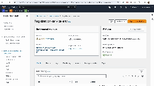
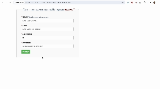
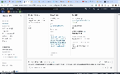
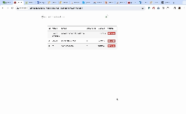

# Full Stack User Registration Application Deployment on AWS

This project is a full-stack user registration application deployed on Amazon Web Services (AWS). It consists of a backend Spring Boot API for managing user registrations and a frontend Angular application for user interaction.

## Backend: Registration Service API

The Registration Service API is a Spring Boot application responsible for handling user registrations. It provides various endpoints for registering users, retrieving user information, and canceling registrations.

### Features

- **User Registration**: Allows users to register by providing their name, email, experience, and domain.
- **Retrieve All Users**: Retrieves a list of all registered users.
- **Find User by Email**: Searches for a user by their email address.
- **Cancel Registration**: Cancels the registration of a user by their ID.

### Endpoints

- `POST /register`: Register a new user.
- `GET /getAllUsers`: Retrieve all registered users.
- `GET /findUser/{email}`: Find a user by email.
- `DELETE /cancel/{id}`: Cancel the registration of a user by ID.

### Technologies Used

- **Spring Boot**: For building and managing the RESTful API.
- **Spring Data JPA**: For interaction with the MySQL database.
- **Lombok**: For reducing boilerplate code in model classes.
- **MySQL**: As the database to store user information.

### Deployment on AWS

1. **Backend Deployment**:
   - Utilized Amazon RDS for creating a MySQL instance to store user data.
   - Deployed the backend Spring Boot application on Elastic Beanstalk (EBS) using an EC2 instance.

## Frontend: User Registration Client

The User Registration Client is an Angular application that provides a user-friendly interface for interacting with the registration service.

### Deployment on AWS

2. **Frontend Deployment**:
   - Hosted the frontend Angular application on Amazon S3 for static web hosting.

## Setup

1. **Backend Configuration**:
   - Configure the `application.properties` file in the backend with your Amazon RDS MySQL database credentials.

2. **Build and Run**:
   - Run the backend Spring Boot application on Elastic Beanstalk.

3. **Frontend Configuration**:
   - Ensure the frontend Angular application is configured to communicate with the deployed backend API endpoints.

4. **Build and Deploy**:
   - Build the frontend Angular application using `ng build` and deploy the generated files to Amazon S3.

## Usage

- Access the deployed frontend application by navigating to the provided Amazon S3 URL.
- Interact with the user registration features provided by the frontend application.
- Monitor backend operations and database interactions through the deployed Spring Boot application on Elastic Beanstalk.

## Note

- This deployment serves as a demonstration of deploying a full-stack application on AWS.
- Additional features like authentication, validation, etc., can be implemented as per requirements.

Feel free to contribute and enhance this project further! If you have any questions or suggestions, please feel free to reach out.

---

## Deployment Results

<!--  -->

<!--  -->

<!--  -->

<!--  -->

Thanks !